<!-- .slide: id="making-games" class="cover" data-background-image="assets/cover.jpg" data-background-opacity="0.2" data-timing="30" -->

# Making games for Ventilastation

Dream Garden at Overkill Festival 2026

Alejandro Cura <!-- .element: class="byline" -->

Notes:
**0:00–0:30.** We will make a small shared garden for a display with no corners. The audience knows games, so spend the time on the unusual screen, a few API rules and the design choices that make this game worth playing. The theme for Overkill 2026 is Dream No Return. Our example lets people drift, grow flowers and choose a slower pace. Use the desktop emulator and the current Ventilastation API, VS2.

Sources: [Sickhouse's 2026 theme](https://www.sickhouse.nl/festival/dream-no-return-2026), [the festival](https://2026.theoverkill.nl/), [Ventilastation](../../en/). Cover photograph: this website's `images/banner.jpg`.

---


<!-- .slide: id="console" data-timing="75" -->

## A console built around a fan

<div class="split">
<div>
<p>Spinning LEDs form the display.</p>
<p>An <strong>ESP32-S3</strong> runs your MicroPython game.</p>
<p>The project is open source and open hardware.</p>
</div>
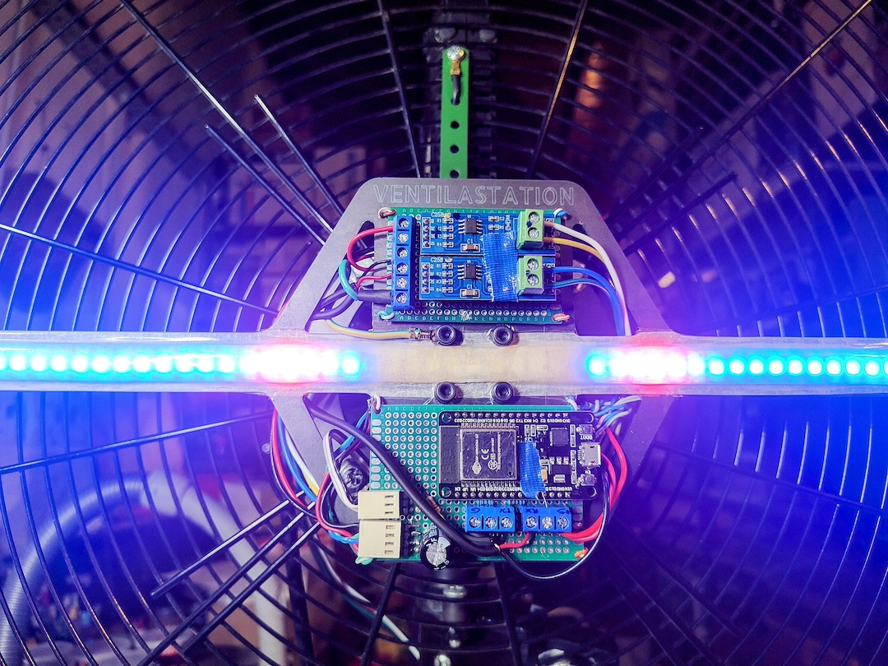
</div>


Notes:
**0:30–1:45.** Keep the hardware introduction short. Persistence of vision turns a rotating LED arm into a disc. The current game target is an ESP32-S3, with roughly 8 MB of RAM shared by the interpreter, heap and image strips. One core handles the game and another handles display work. Audio plays on the base station, not on the rotor. The photo shows a Ventilastation build, not a board identification guide. Game developers can work on a computer without owning or building the console.

Sources: [Tutorial introduction](../../docs/vs2/tutorial/index.html), [website](../../en/). Photograph: this website's `images/pic01.jpg`.

---


<!-- .slide: id="display-in-time" data-timing="90" -->

## The screen is drawn over time

<div class="split">
<div>
<p>A moving LED arm paints each angular column at a different instant.</p>
<p><strong>Persistence of vision</strong> joins those columns into a disc.</p>
<p>The game tick and physical rotation are separate clocks.</p>
</div>
<video src="../../images/banner.mp4" poster="assets/cover.jpg" controls muted loop playsinline data-autoplay aria-label="Ventilastation's real circular LED display in motion"></video>
</div>


Notes:
**1:45–3:15.** A conventional panel has physical pixels distributed over a surface. Ventilastation moves a line of LEDs through that surface and changes their colours at each angle. Your eye integrates the emitted light over a rotation. The output serves 256 angular columns, each with 54 radial LED samples. The renderer prepares polar framebuffers, and the output serves ready columns independently of the 30 ms game tick. Motor speed does not set your update rate. This is why physical brightness, motion and display deadlines matter even when a desktop image looks correct. The clip shows the real display. If video cannot play, the poster still gives the physical context.

Sources: [Physical display and renderer](../../docs/vs2/tutorial/index.html), [geometry](../../docs/vs2/tutorial/display.html). Video: this website's `images/banner.mp4`.

---

<!-- .slide: id="wedge-pixels"  data-timing="90" -->

## The pixels form wedges

<div class="split">
<div>
<p>Each column spans an angle, rather than a fixed horizontal distance.</p>
<p>The same angular step is <strong>wider at the rim</strong> and narrower near the centre.</p>
<p>Moving around the disc also rotates the artwork.</p>
</div>
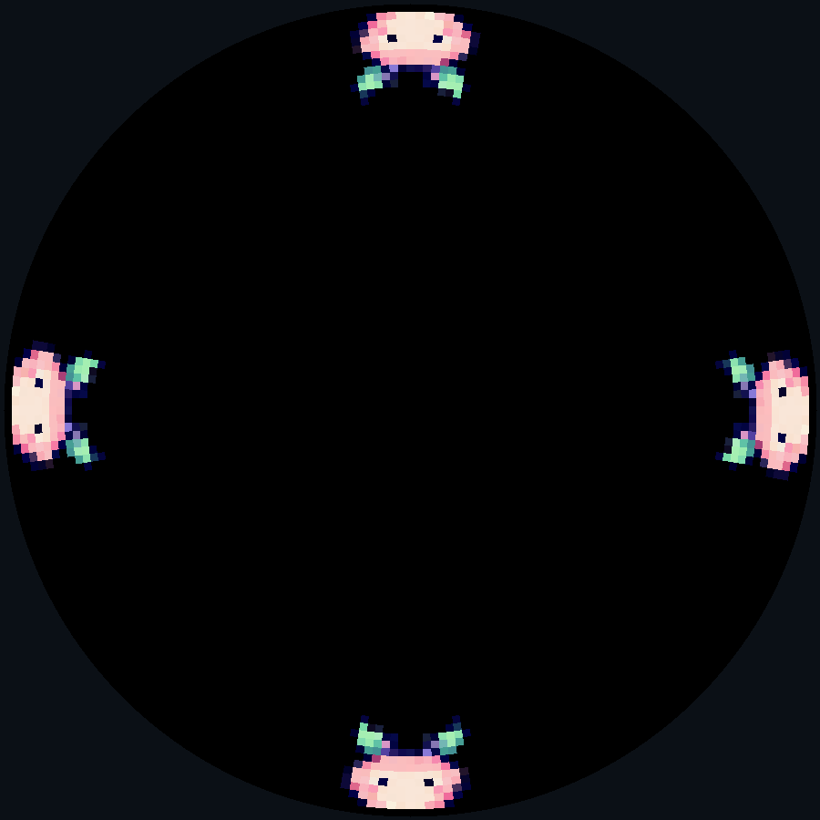
</div>

Notes:
**3:15–4:45.** Here are four copies of our dream creature at the same depth. Their orientation follows the disc. Their antennae point inward rather than staying upright on a rectangular screen. Angular cells get physically narrower near the centre, while the LED bar determines radial spacing. A constant angular velocity covers different physical distances at different radii. Put critical text near the rim and decide whether movement means angle or depth. A garden arranged around the disc lets people tend the whole circumference.

Source: [Circular geometry and sprite orientation](../../docs/vs2/tutorial/display.html). Image: the SDK desktop renderer with Dream Garden's actual assets.

---

<!-- .slide: id="dream-garden"  data-timing="75" -->

## Dream Garden

<div class="split">
<div>
<p>Drift around the rim and catch seeds to grow flowers.</p>
<p>Either player can hold A to <strong>slow the shared flow</strong>.</p>
<p>Passing seeds do no harm. Watching is welcome.</p>
<p class="caption">Inspired by Dream No Return</p>
</div>
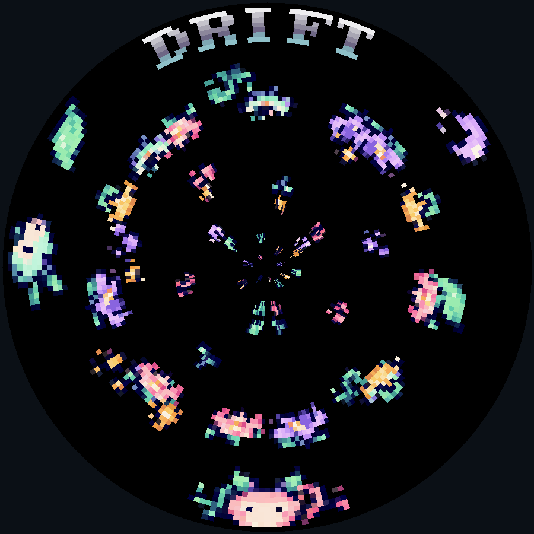
</div>

Notes:
**4:45–6:00.** Overkill's 2026 theme gives us a design prompt about dreaming and rest, with chapters including Time, Shape Shifting, Escape and Lullabies. This game is our response. A pink dreamer catches seeds. A mint friend can join. A catch creates a flower and a miss simply passes. Holding A slows both players' world. There is no score, death, countdown or difficulty ramp. B chooses a still resting scene. Ask the audience what happens when time becomes something players can share rather than a resource they must beat. Then move straight into making it.

Sources: [Sickhouse's theme](https://www.sickhouse.nl/festival/dream-no-return-2026), [finished game source](examples/dream_garden.py). Screenshot: a populated game state rendered by the SDK desktop renderer.

---

<!-- .slide: id="desktop"  data-timing="90" -->

## The desktop development loop

```sh
git clone https://github.com/ventilastation/vsdk.git
cd vsdk
python3 -m venv .venv
. .venv/bin/activate
python -m pip install -r requirements.txt

./vs-emu.sh --game demos.dream_garden
```

Edit local files, rerun, watch the terminal.

Windows uses `vs-emu.bat`. <!-- .element: class="caption" -->

Notes:
**6:00–7:30.** Prepare dependencies before the live demonstration. The setup guide covers Linux, macOS and Windows, including MicroPython and FFmpeg. The desktop host uses CPython, while game code runs in MicroPython. Do not initialize the Retro-Go firmware submodule just to make a game. The terminal shows game prints and tracebacks. The emulator rebuilds changed image ROMs at launch. During this branch preview, check out feat/overkill-dream-garden after cloning, or install the complete game download into an existing current SDK checkout. After the branch merges, the plain clone contains it. Space is A, O is B, P is X and Page Down exits. Two gamepads or the second keyboard controls support shared play.

Sources: [Desktop setup](../../docs/guides/desktop.html), [complete Dream Garden download](examples/dream-garden.zip), [game instructions](examples/dream-garden-guide.html).

---

<!-- .slide: id="game-folder"  data-timing="75" -->

## A game is a folder

```text
games/myname/mygame/
  code/mygame.py
  images/dreamer.png
  images/__images__.yaml
  menu.png
  meta.json
```

```json
{"api": "vs2", "api_revision": 2, "title": "My Garden"}
```

`main()` returns a scene. The menu icon is 64 × 30 pixels.

Notes:
**7:30–8:45.** The code module has the same name as its game folder. Group and folder form the launch name, myname.mygame. The metadata explicitly declares the current API. The launcher discovers the folder without a central application list. Copy dreamer.png and menu.png from the downloaded sample, list only dreamer.png with frames: 8 in the starter YAML, and copy the starter source to code/mygame.py. The finished sample uses demos/dream_garden and code/dream_garden.py. The game download includes its code, images, YAML, icon, sound and source credits.

Sources: [Your first game](../../docs/vs2/tutorial/first-game.html), [starter source](examples/first_game.py), [complete game](examples/dream-garden.zip).

---

<!-- .slide: id="assets"  data-timing="105" -->

## PNGs become indexed image strips

<div class="split">
<div>
<pre><code class="language-yaml" data-trim>palettegroups:
  garden:
    - strip: dreamer.png
      frames: 8</code></pre>
<p>Equally sized frames, arranged horizontally.</p>
<p>256 colours per palette group.</p>
</div>
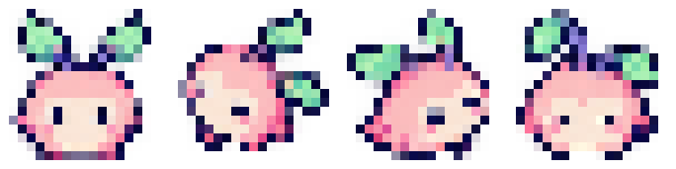
</div>

Notes:
**8:45–10:30.** The console uses compiled strips rather than decoding PNGs during play. The full dreamer strip has eight 19-pixel frames, so it is 152 pixels wide. The picture shows its first four poses. The next four repeat those poses in mint for player two. YAML declares all eight frames. Related art shares a palette group. The full game adds seed, flower and garden strips plus the existing CP437 font in a separate text palette. The artwork came from a generated atlas, then technical cropping, nearest-neighbour resizing and strip packing. You can replace the packed PNGs with your own pixel art. Rerun the emulator after editing assets.

Sources: [Image setup](../../docs/vs2/tutorial/first-game.html), [artwork provenance and preparation](examples/artwork.html). Image: the actual packed dreamer strip, cropped to player one's poses.

---


<!-- .slide: id="lifecycle" data-timing="105" -->

## A scene builds once per entry

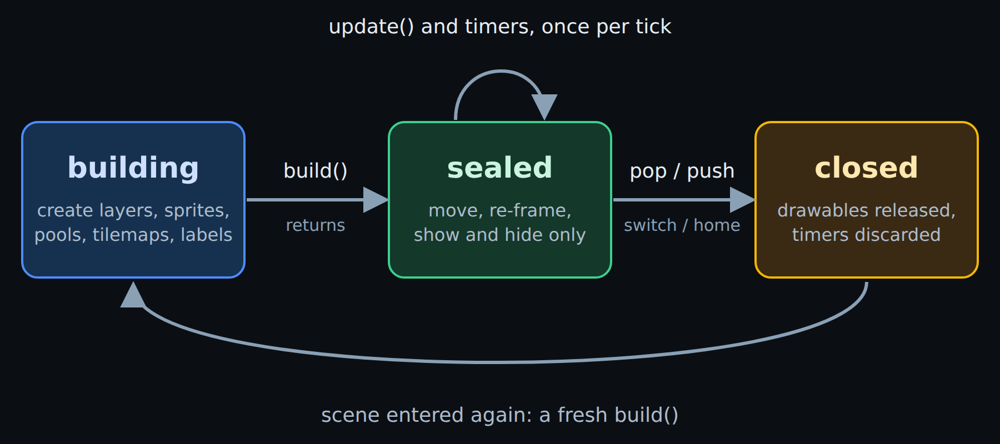 <!-- .element: class="wide-figure" -->

`build()` reserves the display graph.

`update()` changes the existing objects, every 30 ms.


Notes:
**10:30–12:15.** This is the main architectural rule. Create layers, sprites, pools, tilemaps and labels in `build()`. Returning from build seals the scene. Update can move, animate, show and hide them, but creating a new sprite there raises `SceneSealedError`. Structural budgets fail at scene entry rather than in the middle of a run. Build runs again whenever the scene is re-entered, and previous drawable handles are no longer valid. State that should survive belongs in `__init__`. A nominal tick is 30 milliseconds, about 33 updates per second. Slow updates delay the next tick rather than catching up lost time.

Sources and diagram: [Scene lifecycle](../../docs/vs2/reference/scene.html), [runtime constraints](../../docs/vs2/tutorial/index.html).

---

<!-- .slide: id="first-game-code" class="compact" data-timing="90" -->

## A complete first game

```python
import vs2
from vs2.controls import LEFT, RIGHT, joy1

class Game(vs2.Scene):
    def build(self):
        world = self.layer("world", projection=vs2.TUNNEL)
        self.dreamer = world.sprite("dreamer.png", y=0)
        self.dreamer.x = -(self.dreamer.width // 2)

    def update(self):
        steer = joy1.held(LEFT) - joy1.held(RIGHT)
        self.dreamer.x = (self.dreamer.x + steer) % vs2.display.width

def main():
    return Game()
```

Notes:
**12:15–13:45.** Read this as an engine interface rather than a Python lesson. Main returns the first scene. Build creates a TUNNEL layer and a sprite by image name. X is the sprite's edge, so subtracting half its width centres the dreamer on angle zero. Update reads stable controller levels. Left minus right gives a direction and cancels opposite inputs. Wrapping keeps the stored X bounded, and the renderer also handles images crossing the seam. This is complete code once the folder, assets and metadata exist. The download has a short docstring with installation instructions.

Sources: [First game](../../docs/vs2/tutorial/first-game.html), [circular display](../../docs/vs2/tutorial/display.html), [starter code](examples/first_game.py).

---

<!-- .slide: id="first-demo"  data-timing="75" -->

## First checkpoint: a creature you can steer

<div class="split">
<div>
<p><code>./vs-emu.sh --game myname.mygame</code></p>
<p>Arrows drift around the rim.</p>
<p>Positive X turns left at the bottom.</p>
<p class="caption">Desktop demonstration</p>
</div>
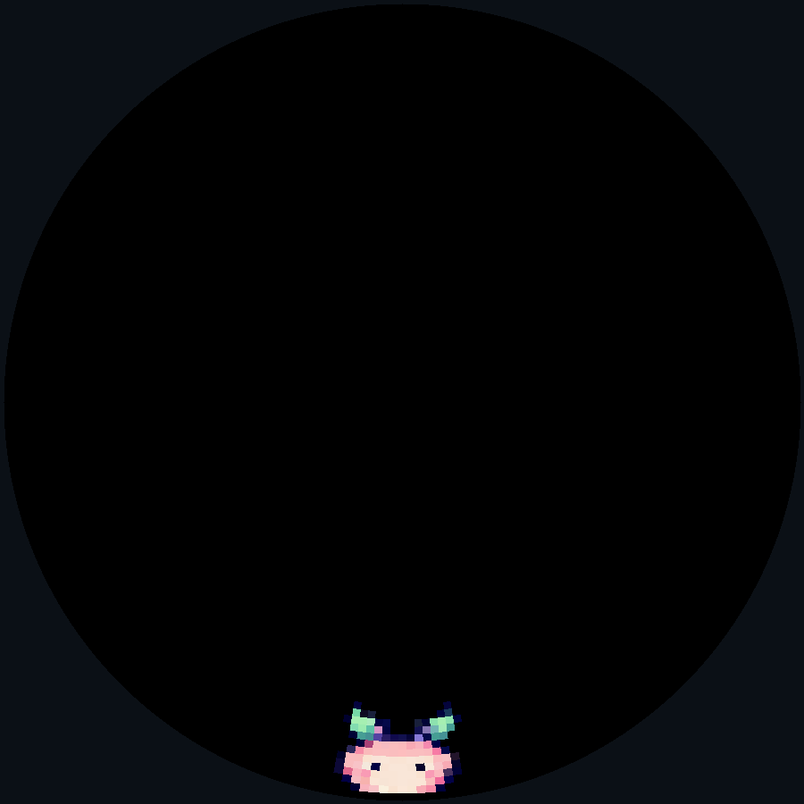
</div>

Notes:
**13:45–15:00.** Switch to the prepared desktop starter. Hold left, cross the seam, then hold right. Show that opposite buttons cancel. Point out the terminal and source file, then return to the deck. The goal is to make the circular coordinate model tangible before adding rules. If the emulator is unavailable, use this real renderer capture and trace the position change aloud. It shows only the starter's one sprite.

Sources: [Starter source](examples/first_game.py), [first-game instructions](../../docs/vs2/tutorial/first-game.html). Screenshot: actual game assets through the SDK renderer, with all other game drawables hidden.

---


<!-- .slide: id="coordinates" data-timing="75" -->

## X is an angle. Y points inward.

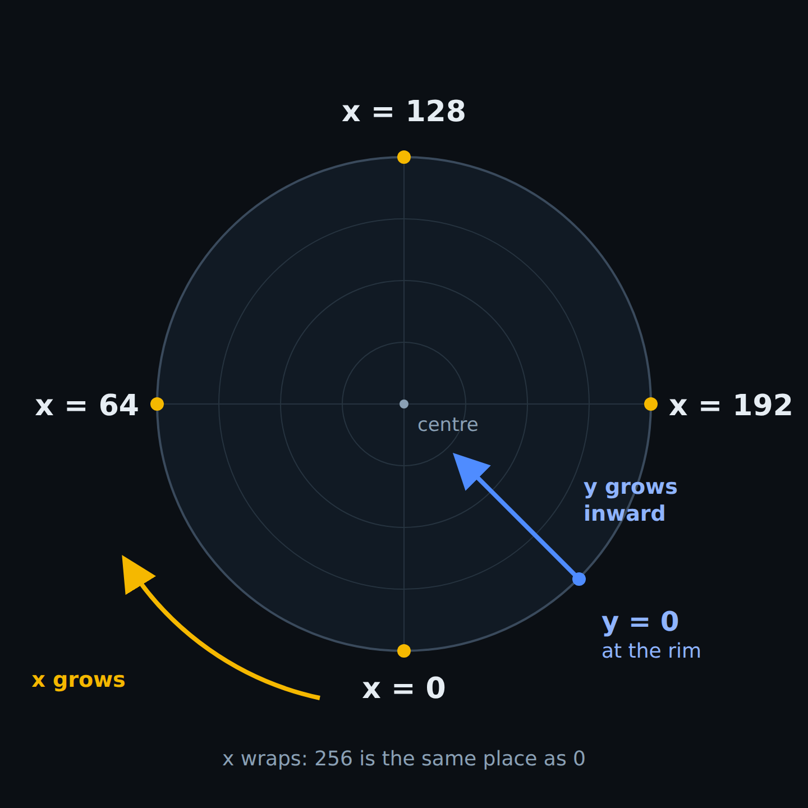 <!-- .element: class="figure" -->


Notes:
**15:00–16:15.** This is the main mental adjustment for developers used to rectangular screens. The logical display has 256 angular columns and 54 radial LEDs. X zero is the bottom, then 64 is left, 128 top, and 192 right. X wraps. Y zero is the outer rim, and positive Y goes inward. A sprite crossing the angular seam stays continuous. The physical width of an angular column decreases near the centre, so a rectangular image gets squeezed there. Use `vs2.display.width` and `.height` to read the geometry, but distinguish physical LED height from tunnel depth on the next slide.

Source and diagram: [The circular display](../../docs/vs2/tutorial/display.html).

---

<!-- .slide: id="projections"  data-timing="90" -->

## Layers choose the projection

<div class="split">
<div>
<p><strong>TUNNEL</strong><br>Y is depth, 0–255. Objects shrink inward.</p>
<p><strong>HUD</strong><br>Y is an LED index, 0–53.</p>
<p><strong>FULLSCREEN</strong><br>A centred image. X rotates it.</p>
</div>
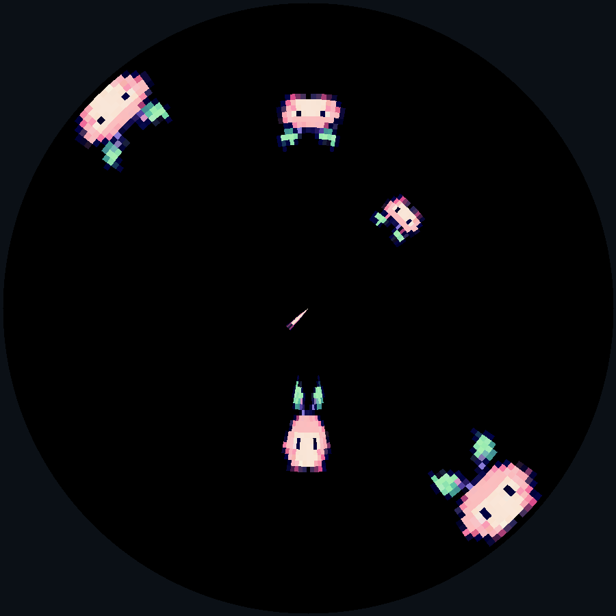
</div>

Notes:
**16:15–17:45.** Choose a projection per layer. Dream Garden uses TUNNEL for its world and HUD for its mood label. These dreamers use Y values 0, 24 and 48 on TUNNEL above and HUD below. Decreasing tunnel depth moves a seed outward toward the players. HUD removes perspective scaling, though angular cells still narrow near the centre. FULLSCREEN draws a centred image whose X rotates it and whose Y follows the tunnel depth curve. It accepts sprites only. Layers paint in creation order, then drawables in creation order inside each layer. The garden comes first, flowers and seeds next, dreamers last, then HUD. Physical height 54 is not a tunnel off-screen threshold.

Source: [Projections and draw order](../../docs/vs2/tutorial/display.html). Image: actual dreamer assets in two SDK scene layers.

---

<!-- .slide: id="animation"  data-timing="90" -->

## Movement and animation are property writes

```python
direction = joy1.held(LEFT) - joy1.held(RIGHT)
self.dreamer.x = (self.dreamer.x + direction) % vs2.display.width

if joy1.held(A):
    self.dreamer.frame = ASLEEP
elif direction > 0:
    self.dreamer.frame = LEFT_POSE
elif direction < 0:
    self.dreamer.frame = RIGHT_POSE
else:
    self.dreamer.frame = AWAKE
```

Player two uses the same poses, starting at frame 4.

Notes:
**17:45–19:15.** Property writes update existing renderer records. Frame picks artwork from the strip without creating a new sprite. Dreamers lean when moving and close their eyes while holding A. The finished helper takes a controller and a base frame, so the second player reuses the same behaviour. Flower pairs pulse using the garden's slow clock. Read available frame counts from sprite.image.frames. Frame and visibility are independent, useful for preparing the second player before joining. Invalid frames fail immediately. Think of the display as a retained graph whose properties change during play.

Sources: [Sprites](../../docs/vs2/tutorial/sprites.html), [Dream Garden's steer helper](examples/dream_garden.py).

---

<!-- .slide: id="pools"  data-timing="90" -->

## Seeds and flowers have bounded pools

```python
# In build():
self.seeds = self.world.sprite_pool("seed.png", count=16)
self.flowers = self.world.sprite_pool(
    "flowers.png", count=24, on_empty=vs2.RECYCLE
)

# During play:
seed = self.seeds.spawn(x=100, y=160)
if seed is None:
    return  # this seed waits for another opportunity
```

A full flower pool reuses its oldest live flower.

Notes:
**19:15–20:45.** Reservation happens once in build. Spawn reveals and positions a reserved sprite. A full seed pool returns None and drops that particular spawn. Flowers instead recycle their oldest live slot, so new growth continues without an ever-growing graph. Both choices are part of the design: the garden can keep changing, yet nothing demands a perfect catch rate. Pools count at their full reserved size, including hidden slots. Iteration visits live sprites and supports retiring the current one. Pooling renderer objects does not remove all unrelated Python allocations.

Source: [Sprite pools](../../docs/vs2/tutorial/pools.html), [sample source](examples/dream_garden.py).

---

<!-- .slide: id="spawn-timer"  data-timing="75" -->

## A timer controls the seed rhythm

```python
from urandom import randrange

# At the end of build():
self.call_later(self.spawn_ms, self.spawn_seed)

def spawn_seed(self):
    self.seeds.spawn(
        x=randrange(vs2.display.width), y=160
    )
    self.call_later(self.spawn_ms, self.spawn_seed)
```

1.8 seconds drifting. 4 seconds while holding A.

Notes:
**20:45–22:00.** The callback rearms itself with the current gap. A held A changes spawn_ms, but a seed that is already scheduled keeps its deadline. The next gap uses the slower rhythm. Seed movement reacts immediately in update. This avoids rebuilding or continually replacing timer records while a button is held. A full pool simply skips a spawn. Scene-owned timers disappear when the scene closes or suspends, so an old callback cannot plant into the rest screen. Timers suit occasional events, not the animation loop.

Sources: [Scene timers](../../docs/vs2/reference/scene.html), [sample spawn_seed](examples/dream_garden.py).

---

<!-- .slide: id="collision"  data-timing="90" -->

## A collision grows a flower

```python
if seed.overlaps(self.dreamer):
    self.bloom(seed)
elif seed.y < -seed.image.height:
    self.seeds.despawn(seed)
```

X wraps across column zero. Y does not wrap.

The full game checks both active dreamers.

Notes:
**22:00–23:30.** Collision tests use axis-aligned bounds in a layer's circular coordinate system. They understand the angular seam, so a dreamer crossing zero can still catch a seed without a duplicate actor. They are not pixel-perfect physical tests on the fan. The actual loop first decreases seed depth, then checks either active dreamer. Bloom retires the seed and spawns a flower centred at its angle. A missed seed retires after passing the rim. The response changes the garden without ending play or recording failure. This is a small code change with a large effect on the experience.

Sources: [Collision API](../../docs/vs2/tutorial/sprites.html), [Dream Garden's move_seeds and bloom](examples/dream_garden.py).

---

<!-- .slide: id="tilemap"  data-timing="75" -->

## The drifting garden is one tilemap

<div class="split">
<div>
<pre><code class="language-python" data-trim>self.ground = world.tilemap(
    "garden.png",
    columns=16, rows=16,
    view_width=256,
    view_height=160
)
self.ground[1, 2] = vs2.EMPTY_TILE</code></pre>
<p>Sparse accents leave room for the seeds.</p>
</div>
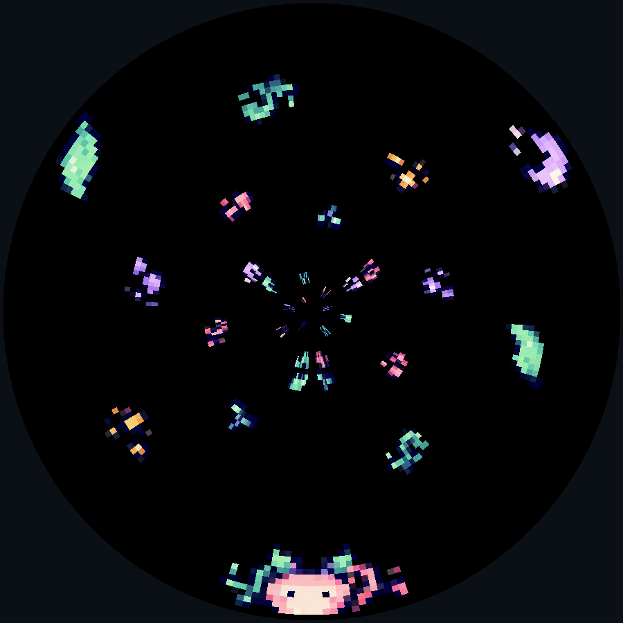
</div>

Notes:
**23:30–24:45.** The garden tiles are frames in another strip. One byte per cell chooses a frame or EMPTY_TILE. Dimensions describe the stored grid and its viewport, not a conventional screen resolution. Build fills a sparse repeating pattern of roots, petals and moons. Transparent cells preserve dark space so seeds remain visible. The map comes first in draw order. A tilemap fits repeated terrain better than dozens of separate sprites, although its rendering cost still depends on the actual viewport and content.

Source: [Tilemaps](../../docs/vs2/tutorial/tilemaps-and-text.html). Image: the sample's ground tilemap and dreamer through the SDK renderer.

---

<!-- .slide: id="scroll"  data-timing="75" -->

## Scrolling moves the view

```python
pattern_height = 6 * self.ground.tile_height
self.scroll = (self.scroll + self.speed) % pattern_height
self.ground.view_y = self.scroll

for seed in self.seeds:
    seed.y -= self.speed
```

The garden repeats every six tile rows.

The seeds share its pace.

Notes:
**24:45–26:00.** The map is stored data plus a movable view. Wrapping a six-row pattern avoids rewriting cells every tick. Drift speed is 0.45 depth units per tick, and holding A reduces it to 0.12. Seeds decrease Y by the same speed, sharing the background's movement. This ties the visible world's rhythm to the player's choice. A non-repeating world would refill a row when a tile passes. Flower animation also uses dream_time, advanced by the same speed and wrapped to keep it bounded.

Sources: [Tilemap scrolling](../../docs/vs2/tutorial/tilemaps-and-text.html), [Dream Garden update](examples/dream_garden.py).

---

<!-- .slide: id="mood"  data-timing="90" -->

## The HUD sets the mood

```python
self.mood = self.hud.label(
    "steel8x8.png", columns=5, x=108, y=1,
    flip_x=True, flip_y=True, text="DRIFT"
)

# When the shared state changes:
self.mood.text = "REST" if slow else "DRIFT"
```

Low Y keeps text legible.

Both flips make top text upright.

Notes:
**26:00–27:30.** A label uses a tilemap record rather than a sprite per character. Five eight-column glyphs span forty columns, so x 108 centres the label on top angle 128. At the top, the native inward-facing orientation makes text upside down unless both axes flip. Y 1 keeps it near the rim. A mood word tells players that their button changes the shared world. Update it only when slow changes, rather than rewriting text every tick. This uses the SDK's existing full CP437 font. A short word also avoids making a large dashboard on a small disc.

Source: [Labels and flips](../../docs/vs2/tutorial/tilemaps-and-text.html), [sample source](examples/dream_garden.py).

---

<!-- .slide: id="scenes"  data-timing="90" -->

## Title, garden and rest scenes

```python
self.switch(Garden())          # A on the title
self.switch(Rest(flowers))     # B in the garden
self.switch(Garden())          # A after resting

self.push(PauseMenu())         # suspend, show another scene
self.pop()                     # resume below, or leave
```

Transitions commit at the end of the tick.

B keeps the flowers in a still garden.

Notes:
**27:30–29:00.** Rest is a voluntary transition. On B, the game snapshots flower angles and frames at this scene boundary, stops music and switches to Rest. Its build recreates those flowers and a short invitation to begin another dream. There is no game-over scene. Durable state belongs in __init__, while drawable handles belong in build. Use push and pop if you want a modal overlay that resumes the previous scene. Suspension releases its graph and timers, so resumption rebuilds them. Return after queuing a transition. Only one transition is allowed per tick and later callbacks will not touch the outgoing scene.

Sources: [Scene reference](../../docs/vs2/reference/scene.html), [Title, Garden and Rest source](examples/dream_garden.py).

---

<!-- .slide: id="input"  data-timing="60" -->

## Two people can share one garden

```python
joy1.held(LEFT)       # continuous steering
joy2.held(A)          # the friend asks for slower time
joy1.just_pressed(B)  # choose the rest scene
```

The second dreamer joins an already reserved sprite.

`idle_timeout = None` welcomes watching. Y or Back still exits.

Notes:
**29:00–30:00.** Both controllers expose stable level and edge reads for the tick. The second player's first steering input or A press reveals the mint dreamer reserved in build. No new sprite allocation is needed. Either active player can hold A to affect the whole garden. Garden and Rest explicitly disable the default thirty-second idle exit because watching is an intentional activity here. The title keeps its default timeout. Y and Back remain the shared arcade's exit route. Keyboard player two uses H/L to steer, Z for A, X for B and C for the X action, while two gamepads use their normal mappings.

Sources: [Controls reference](../../docs/vs2/reference/services.html#vs2-controls), [Scene idle behaviour](../../docs/vs2/reference/scene.html), [game controls](examples/dream-garden-guide.html).

---

<!-- .slide: id="audio"  data-timing="60" -->

## A quiet lullaby is optional

```python
vs2.audio.music("lullaby", loop=True)
vs2.audio.sound("bloom")
vs2.audio.stop_music()
```

X toggles sound. It starts off.

MP3s play on the base or desktop host.

Notes:
**30:00–31:00.** The game includes an original soft tone loop and a short bloom chime. X opts in, and the next X press stops the music. Bloom sound only plays while sound is on. B also stops music before resting. Names resolve to MP3s in this game's sounds folder. Audio does not go into image ROMs or rotor RAM. The ESP32 sends commands to the Raspberry Pi base or emulator host. Music can continue across scenes in the same application and stops when returning to the launcher, so we deliberately stop it sooner at rest. Check the room's volume before the demonstration.

Sources: [Audio API](../../docs/vs2/reference/services.html#vs2-audio), [original audio recipe](examples/artwork.html), [game source](examples/dream_garden.py).

---

<!-- .slide: id="shared-time"  data-timing="45" -->

## Players can change the pace

<div class="split">
<div>
<pre><code class="language-python" data-trim>slow = joy1.held(A) or (
    self.joined and joy2.held(A)
)
self.speed = 0.12 if slow else 0.45
self.spawn_ms = 4000 if slow else 1800</code></pre>
<p>One request changes the shared world.</p>
</div>
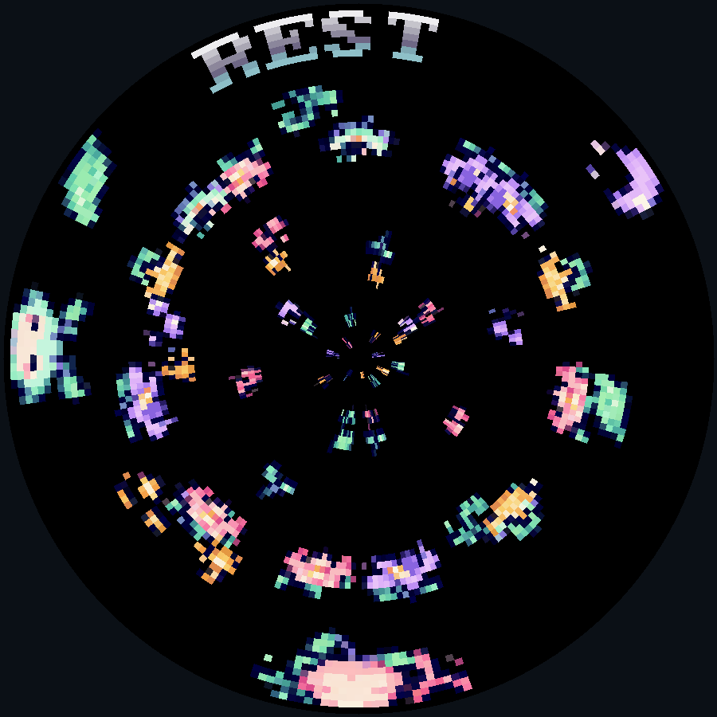
</div>

Notes:
**31:00–31:45.** The final mechanic is deliberately small. Either player's request slows every seed, the background and flower animation. Spawn intervals adapt at the next scheduled callback. Steering stays responsive. Nothing raises the pace because of a score or elapsed time. For the festival, the interesting discussion is what this asks people to do together. They can catch seeds, make room for a friend, hold time slower or simply watch. Invite the audience to imagine another interaction with shared time.

Source: [Garden update](examples/dream_garden.py). Screenshot: an actual held-A game state through the SDK renderer.

---

<!-- .slide: id="budgets"  data-timing="90" -->

## The display graph has explicit budgets

| Resource | Dream Garden | Limit |
|---|---:|---:|
| Layers | 2 | 8 |
| Sprites | 42 | 100 |
| Tilemaps, including labels | 2 | 16 |
| Image strips per asset pack | 5 | 100 |

Read the target limits from `vs2.limits`.

Notes:
**31:45–33:15.** Forty-two sprites means two reserved dreamers, sixteen seeds and twenty-four flowers. Hidden player two and empty pool slots still count. The ground and mood label use two tilemap records. Five strips include the full font shared by the other scenes. Layers and records are separate resources. VS2 checks the graph at entry and reports the layers contributing to an exceeded budget. Tilemaps can be costly even when their record count is low. Our bounded garden can run indefinitely without growing its renderer graph. Target timing and heap still need measurement on the console.

Sources: [Resource limits](../../docs/vs2/reference/services.html#vs2-limits), [sample build](examples/dream_garden.py).

---

<!-- .slide: id="heap"  data-timing="75" -->

## Heap stability is part of game correctness

```python
seed.y -= self.speed
self.flowers.spawn(x=angle, y=24, frame=kind * 2)
self.seeds.despawn(seed)
```

Sealing controls render-object creation, not every Python allocation.

Long play still needs a target check.

Notes:
**33:15–34:30.** A garden that welcomes watching should survive a long session. Pools bound the renderer graph, but Python temporaries can still accumulate on the target. Garbage collection happens around scene boundaries, while the desktop emulator has more headroom and collects automatically. Keep the update loop short and reuse handles. The sample bounds scroll and dream_time and rewrites its mood label only on a state change. It snapshots a small flower list only when leaving for Rest. Those choices do not prove zero heap growth or sufficient hardware frame timing. Measure sustained play and the full garden on the rotor before an exhibition.

Sources: [Allocation and target checks](../../docs/vs2/tutorial/budgets.html), [sample source](examples/dream_garden.py).

---

<!-- .slide: id="hardware-check"  data-timing="90" -->

## The disc decides what is readable

<div class="split">
<div>
<p>Text belongs near the rim.</p>
<p>Dark space keeps the seeds visible.</p>
<p>Check timing and intensity on hardware.</p>
</div>
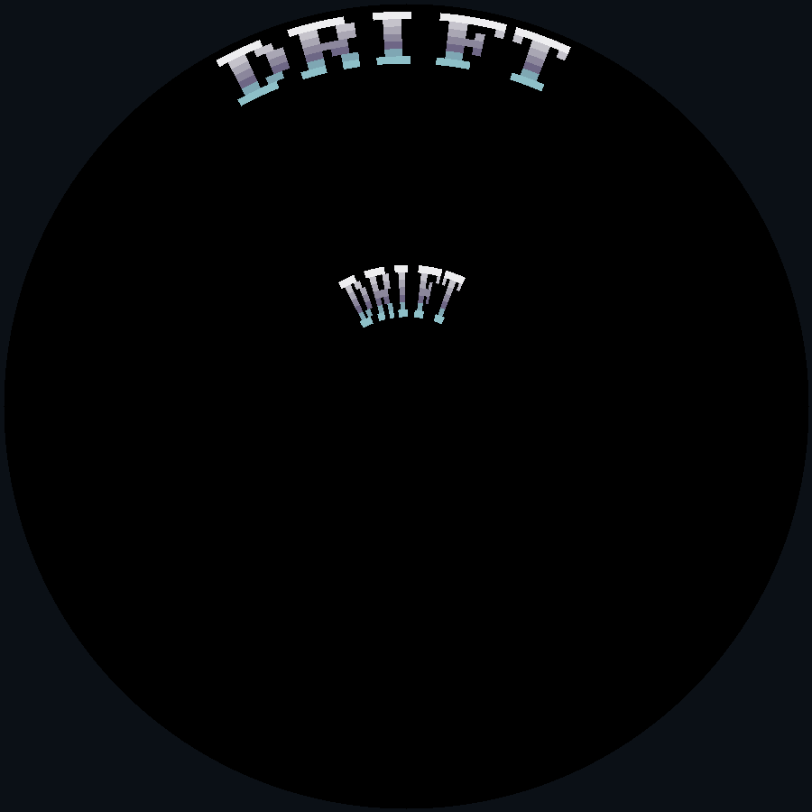
</div>

Notes:
**34:30–36:00.** The emulator preserves renderer semantics, but cannot judge physical brightness or enforce the real output's column deadline. These copies of DRIFT use HUD positions 1 and 35. The inner word compresses because angular cells have less circumference. Keep critical instructions near the rim and let the centre convey depth or drifting effects. Our leaves, blossoms and seeds are deliberately sparse. Test their contrast and recognizability on the real LEDs, along with a crowded garden and a sustained session. This is how the display geometry feeds back into the game rather than remaining an introduction slide.

Source: [Hardware and legibility](../../docs/vs2/tutorial/budgets.html). Image: actual font labels through the SDK renderer.

---

<!-- .slide: id="finished-demo"  data-timing="120" -->

## Second checkpoint: a shared dream

<div class="split">
<div>
<p><code>./vs-emu.sh --game demos.dream_garden</code></p>
<p>Catch a seed, invite a friend, hold A.</p>
<p>B rests with the flowers. A begins again.</p>
<p class="caption">Desktop demonstration</p>
</div>
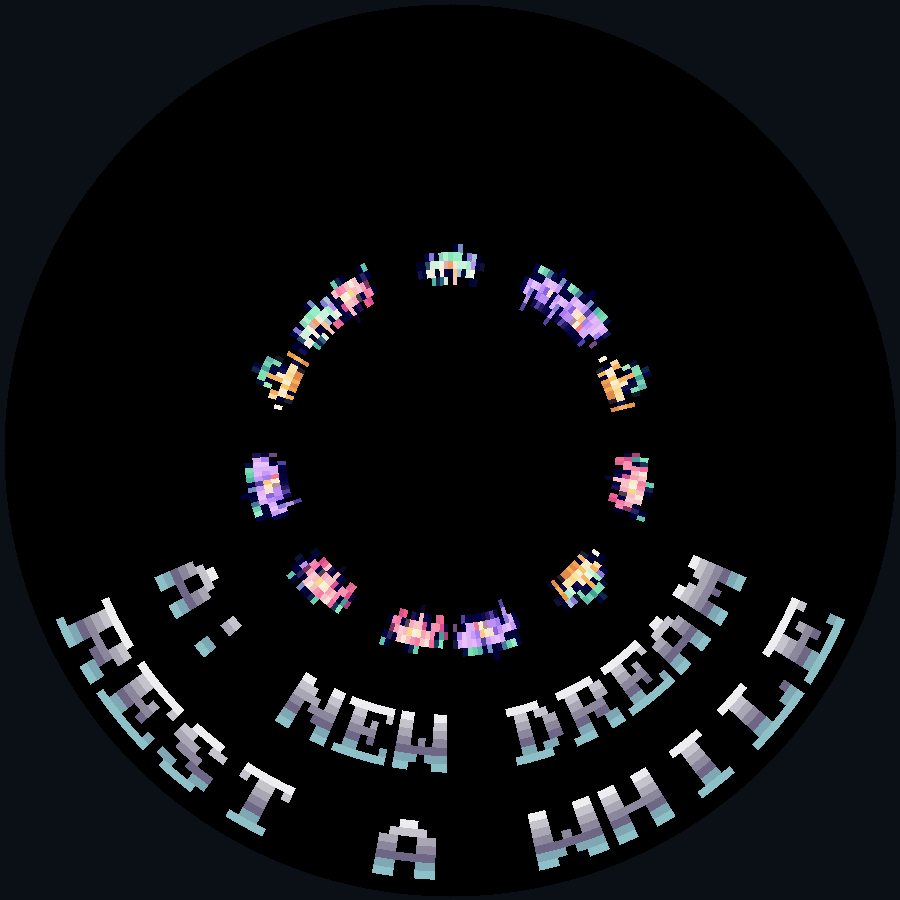
</div>

Notes:
**36:00–38:00.** Run the finished game. A begins. Show the dreamer moving and deliberately catch a seed to grow a flower. Let another seed pass to show that it causes no harm. Invite a second person or use H/L and Z to reveal the mint friend. Have either player hold A and point out the REST label and slower background. Use X or keyboard P to opt into the lullaby at a suitable room volume. B or O chooses Rest, preserving the flowers while stopping audio. A begins a fresh dream. Y or Page Down returns to the launcher. If hardware is available, show the same game without spending the demo on flashing. Otherwise use the screenshots. Keep source open at build, move_seeds and update.

Sources: [Finished source](examples/dream_garden.py), [game instructions](examples/dream-garden-guide.html), [complete download](examples/dream-garden.zip). Screenshot: the actual Rest scene through the SDK renderer.

---


<!-- .slide: id="sharing" data-timing="60" -->

## A game travels with its source and assets

- Matching `code/<name>.py` entry point
- PNG strips and `__images__.yaml`
- Menu icon and VS2 metadata
- Sound files and credits for borrowed assets

[Assets, menu and sharing](../../docs/guides/assets-and-sharing.html)


Notes:
**38:00–39:00.** Share the source folder under games/group/name. Leave generated ROMs to the build pipeline. Keep the entry-point name and metadata consistent, include every referenced image, and check a fresh checkout rather than relying on files left on your laptop. The guide covers menu placement and contributions to the repository. Borrowed artwork and sounds need credits and compatible permissions. A small complete game is a good first contribution. A hardware-tested build lets the next person spend time playing rather than guessing how to assemble the assets.

Source: [Assets, menu and sharing](../../docs/guides/assets-and-sharing.html).

---

<!-- .slide: id="next-game"  data-timing="60" -->

## Your next circular game

[Desktop setup](../../docs/guides/desktop.html)

[Dream Garden source and complete download](examples/dream-garden-guide.html)

[Ventilastation API reference](../../docs/vs2/reference/index.html)

[First-game starter](examples/first_game.py)

[General API walkthrough](../../docs/vs2/tutorial/index.html)

Notes:
**39:00–40:00.** The game guide includes installation, both controller mappings, source and the complete asset folder. The small starter gets one dreamer moving. The general tutorial still teaches the same API using its separate Trench Run example, so do not describe it as a chapter-by-chapter Dream Garden tutorial. The reference gives the full interface after the audience has the circular mental model. Invite people to change a rule, a rhythm or an interaction in this garden, then test that choice on the desktop and physical disc. For a festival audience, ask what shared play on this unusual object could feel like.

Sources: the linked current documentation and sample files.

---

<!-- .slide: id="questions" class="statement" data-timing="300" -->

## Questions

What would you dream on a disc?

[ventilastation.protocultura.net](https://ventilastation.protocultura.net/)

Notes:
**40:00–45:00.** Leave five minutes for questions. Keep the desktop game and source available. Discuss display geometry, shared time, collision space, projection choice, reserve sizing, asset palettes and physical testing. If someone wants to build the console, point them to the repository after the session. The reading view contains these notes and the game download. Finish with a clear route to making a circular game and room for the audience's own ideas.
