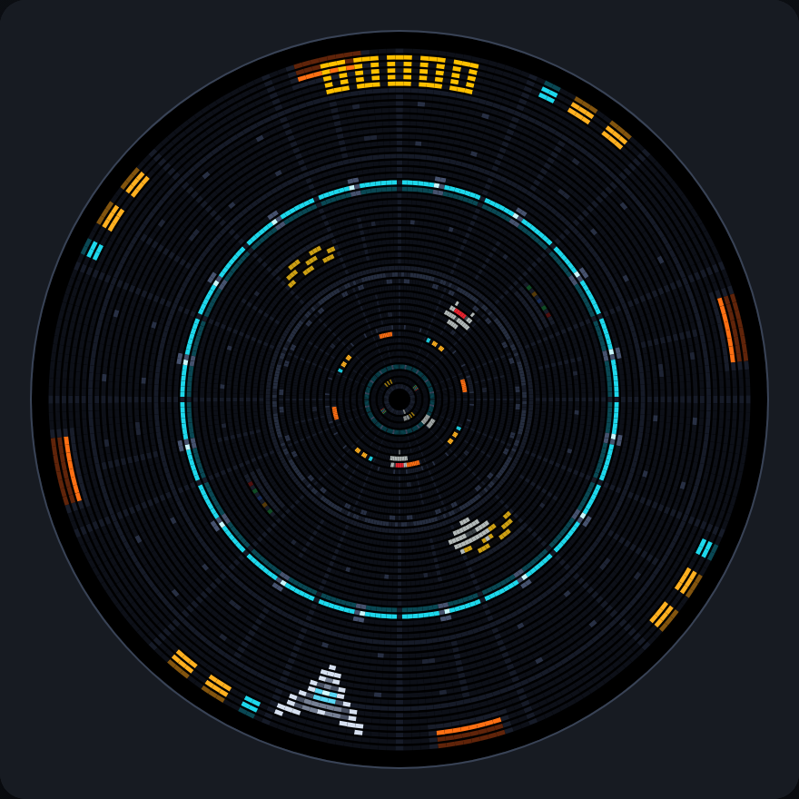
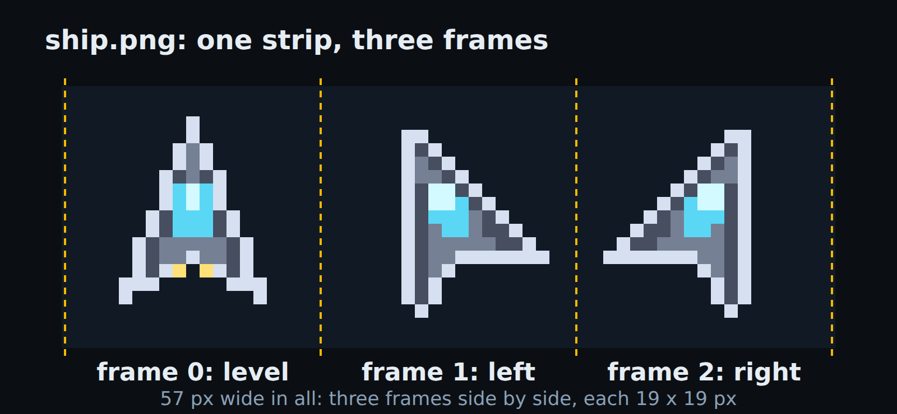
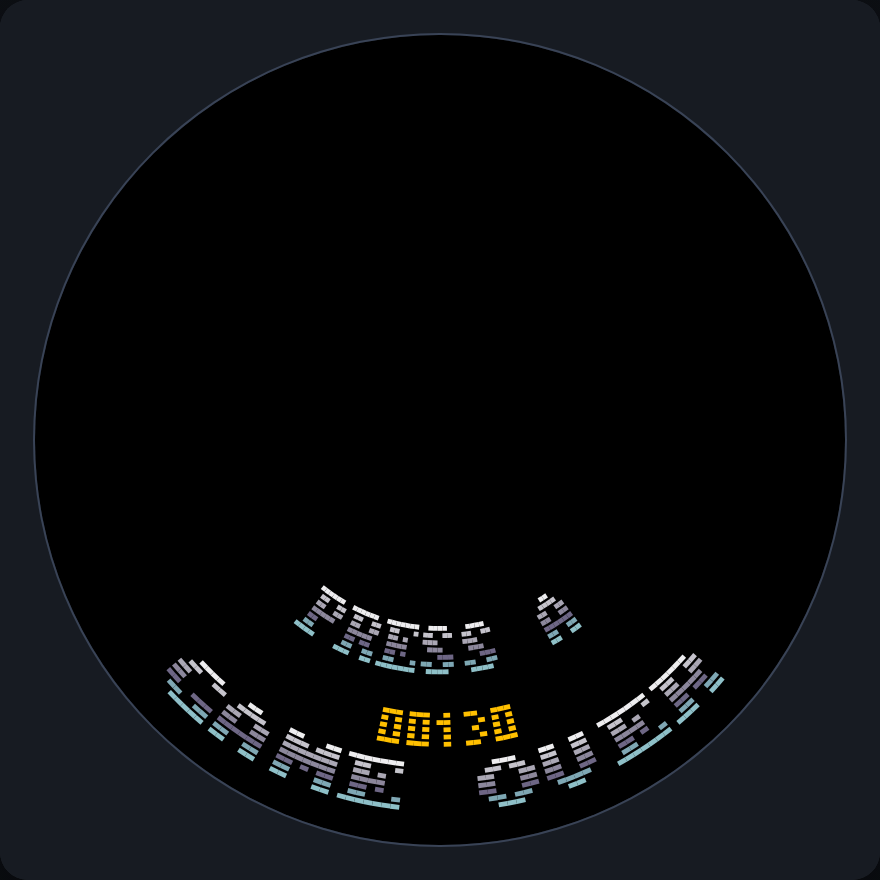

<!-- .slide: id="making-games" class="cover" data-timing="30" data-background-image="assets/cover.jpg" data-background-opacity="0.2" -->

# Making games for Ventilastation

MicroPython on a circular arcade display

Alejandro Cura <!-- .element: class="byline" -->

Notes:
**0:00–0:30.** Today we will build a small arcade game for a display with no corners. Assume familiarity with game loops, sprites and object pools. The interesting part is how those familiar ideas map onto the disc and a small MicroPython machine. We will use the desktop emulator and the current Ventilastation API, VS2.

Source: [Ventilastation](../../en/). Cover image: this website's `images/banner.jpg`.

---

<!-- .slide: id="console" data-timing="75" -->

## A console built around a fan

<div class="split">
<div>
<p>Spinning LEDs form the display.</p>
<p>An <strong>ESP32-S3</strong> runs your MicroPython game.</p>
<p>The project is open source and open hardware.</p>
</div>

</div>

Notes:
**0:30–1:45.** Keep the hardware introduction short. Persistence of vision turns a rotating LED arm into a disc. The current game target is an ESP32-S3, with roughly 8 MB of RAM shared by the interpreter, heap and image strips. One core handles the game and another handles display work. Audio plays on the base station, not on the rotor. The photo shows a Ventilastation build, not a board identification guide. Game developers can work on a computer without owning or building the console.

Sources: [Tutorial introduction](../../docs/vs2/tutorial/index.html), [website](../../en/). Photograph: this website's `images/pic01.jpg`.

---

<!-- .slide: id="display-in-time" data-timing="90" -->

## The screen is drawn over time

<div class="split">
<div>
<p>A moving LED arm paints each angular column at a different instant.</p>
<p><strong>Persistence of vision</strong> joins those columns into a disc.</p>
<p>The game tick and physical rotation are separate clocks.</p>
</div>
<video src="../../images/banner.mp4" poster="assets/cover.jpg" controls muted loop playsinline data-autoplay aria-label="Ventilastation's real circular LED display in motion"></video>
</div>

Notes:
**1:45–3:15.** A conventional panel has physical pixels distributed over a surface. Ventilastation moves a line of LEDs through that surface and changes their colours at each angle. Your eye integrates the emitted light over a rotation. The output serves 256 angular columns, each with 54 radial LED samples. The renderer prepares polar framebuffers, and the output serves ready columns independently of the 30 ms game tick. Motor speed does not set your update rate. This is why physical brightness, motion and display deadlines matter even when a desktop image looks correct. The clip shows the real display. If video cannot play, the poster still gives the physical context.

Sources: [Physical display and renderer](../../docs/vs2/tutorial/index.html), [geometry](../../docs/vs2/tutorial/display.html). Video: this website's `images/banner.mp4`.

---

<!-- .slide: id="wedge-pixels" data-timing="90" -->

## The pixels form wedges

<div class="split">
<div>
<p>Each column spans an angle, rather than a fixed horizontal distance.</p>
<p>The same angular step is <strong>wider at the rim</strong> and narrower near the centre.</p>
<p>Moving around the disc also rotates the artwork.</p>
</div>

</div>

Notes:
**3:15–4:45.** Here are four instances of the same ship at the same depth. The renderer carries them around a circular coordinate system, so their orientation follows the disc. They point toward the centre rather than remaining screen-upright. The cells occupy angular sectors. Their physical arc width depends on radius, while radial spacing comes from the LED bar. There is no uniform square-pixel grid and no useful rectangular corner. A constant angular velocity produces different physical travel distances at different radii. Design consequences: put critical text near the rim, choose whether motion means angle or depth, and think about orientation before placing a HUD. A circular arena or tunnel takes advantage of this geometry directly.

Source and image: [Circular geometry and sprite orientation](../../docs/vs2/tutorial/display.html).

---

<!-- .slide: id="trench-run" data-timing="75" -->

## The game: Trench Run

<div class="split">
<div>
<p>Steer around the rim.</p>
<p>Dodge enemies coming out of the tunnel.</p>
<p>Each enemy you avoid adds to the score.</p>
<p><strong>One example throughout the talk.</strong></p>
</div>

</div>

Notes:
**4:45–6:00.** Establish the game rule before discussing the API. The ship lives at the outer rim and moves around it. Enemies move outward from the centre. A hit ends the run. Dodged enemies score points, and the game gradually gets faster and busier. This is the finished example from the SDK tutorial. We will first make the ship move, then add the parts that turn it into a game. Point out that the score reads upright at the top and the player remains near the bottom only until you steer.

Source and screenshot: [Trench Run tutorial](../../docs/vs2/tutorial/index.html).

---

<!-- .slide: id="desktop" data-timing="90" -->

## The desktop development loop

```sh
git clone https://github.com/ventilastation/vsdk.git
cd vsdk
python3 -m venv .venv
. .venv/bin/activate
python -m pip install -r requirements.txt

./vs-emu.sh --game demos.tutorial_game
```

Edit local files, rerun, watch the terminal.

Windows uses `vs-emu.bat`. <!-- .element: class="caption" -->

Notes:
**6:00–7:30.** Dependencies should already be installed for the live demonstration. The setup guide covers Linux, macOS and Windows, including MicroPython and FFmpeg. The host uses CPython, while game code runs in MicroPython. Do not initialize the Retro-Go firmware submodule just to write a game. The terminal is the debugger's first stop: it shows game prints and tracebacks. The emulator rebuilds changed image ROMs when it starts. This is an edit-and-rerun workflow. On Windows create and activate the environment using the guide's Command Prompt commands. Space maps to A, arrows steer, Page Down returns to the launcher. Keep a known working game ready before changing your own files.

Source: [Desktop setup](../../docs/guides/desktop.html).

---

<!-- .slide: id="game-folder" data-timing="75" -->

## A game is a folder

```text
games/myname/mygame/
  code/mygame.py
  images/ship.png
  images/__images__.yaml
  menu.png
  meta.json
```

```json
{"api": "vs2", "api_revision": 2, "title": "My Game"}
```

`main()` returns a scene. The menu icon is 64 × 30 pixels.

Notes:
**7:30–8:45.** The code module has the same name as its game folder. The group and folder form the launch name: `myname.mygame`. Metadata declares the VS2 API and revision explicitly. The launcher discovers the folder, so you do not edit a central application list. Copy a menu icon from the tutorial to get started, then make one that represents your game. The complete starter linked in the reading view is small enough to inspect in one editor window.

Source: [Your first game](../../docs/vs2/tutorial/first-game.html). [Complete starter](examples/first_game.py).

---

<!-- .slide: id="assets" data-timing="105" -->

## PNGs become indexed image strips

<div class="split">
<div>
<pre><code class="language-yaml" data-trim>palettegroups:
  main:
    - strip: ship.png
      frames: 3</code></pre>
<p>Equally sized frames, arranged horizontally.</p>
<p>256 colours per palette group.</p>
</div>

</div>

Notes:
**8:45–10:30.** The console uses compiled strips, not PNG decoding during play. This ship is 57 pixels wide: three 19-pixel frames. YAML says how many frames the PNG contains. Similar artwork can share a palette group. Every file the YAML names must exist or ROM generation fails, so the starter lists only its ship. The full tutorial adds enemies, trench tiles and numeral and font strips. Rerun the emulator after editing a PNG or the YAML. These are game assets, not hardware firmware, and you can work on them using your normal pixel-art tools.

Source and strip image: [Image setup](../../docs/vs2/tutorial/first-game.html).

---

<!-- .slide: id="lifecycle" data-timing="105" -->

## A scene builds once per entry

 <!-- .element: class="wide-figure" -->

`build()` reserves the display graph.

`update()` changes the existing objects, every 30 ms.

Notes:
**10:30–12:15.** This is the main architectural rule. Create layers, sprites, pools, tilemaps and labels in `build()`. Returning from build seals the scene. Update can move, animate, show and hide them, but creating a new sprite there raises `SceneSealedError`. Structural budgets fail at scene entry rather than in the middle of a run. Build runs again whenever the scene is re-entered, and previous drawable handles are no longer valid. State that should survive belongs in `__init__`. A nominal tick is 30 milliseconds, about 33 updates per second. Slow updates delay the next tick rather than catching up lost time.

Sources and diagram: [Scene lifecycle](../../docs/vs2/reference/scene.html), [runtime constraints](../../docs/vs2/tutorial/index.html).

---

<!-- .slide: id="first-game-code" class="compact" data-timing="90" -->

## A complete first game

```python
import vs2
from vs2.controls import LEFT, RIGHT, joy1

class Game(vs2.Scene):
    def build(self):
        world = self.layer("world", projection=vs2.TUNNEL)
        self.ship = world.sprite("ship.png", y=0)
        self.ship.x = -(self.ship.width // 2)

    def update(self):
        steer = joy1.held(LEFT) - joy1.held(RIGHT)
        self.ship.x = (self.ship.x + steer) % vs2.display.width

def main():
    return Game()
```

Notes:
**12:15–13:45.** Walk through this as an engine interface, not a Python lesson. Main returns the initial scene. Build creates a TUNNEL layer and a sprite by image name. A sprite's x is its edge, so subtracting half its width centres the ship on angle zero. Update reads a controller level. Left minus right gives a direction and makes simultaneous opposite inputs cancel. Geometry wrapping keeps the stored position bounded. The displayed image wraps too, even at negative positions. This is a complete program once the folder, YAML and metadata are present. The downloadable starter contains this code with a short docstring.

Sources: [First game](../../docs/vs2/tutorial/first-game.html), [circular display](../../docs/vs2/tutorial/display.html). [Starter source](examples/first_game.py).

---

<!-- .slide: id="first-demo" data-timing="75" -->

## First checkpoint: a ship you can steer

<div class="split">
<div>
<p><code>./vs-emu.sh --game myname.mygame</code></p>
<p>Arrows steer around the rim.</p>
<p>Positive X turns left at the bottom.</p>
<p class="caption">Desktop demonstration</p>
</div>

</div>

Notes:
**13:45–15:00.** Switch to the prepared desktop starter. Hold left, cross the seam, then hold right. Show that two opposite buttons cancel. Point out the terminal and the source file, then return to the deck. Keep this demonstration short. If the emulator is unavailable, use the screenshot and trace the code's position change aloud. The screenshot is deliberately the same simple state the audience can reproduce from the previous slide.

Source and screenshot: [First game checkpoint](../../docs/vs2/tutorial/first-game.html).

---

<!-- .slide: id="coordinates" data-timing="75" -->

## X is an angle. Y points inward.

 <!-- .element: class="figure" -->

Notes:
**15:00–16:15.** This is the main mental adjustment for developers used to rectangular screens. The logical display has 256 angular columns and 54 radial LEDs. X zero is the bottom, then 64 is left, 128 top, and 192 right. X wraps. Y zero is the outer rim, and positive Y goes inward. A sprite crossing the angular seam stays continuous. The physical width of an angular column decreases near the centre, so a rectangular image gets squeezed there. Use `vs2.display.width` and `.height` to read the geometry, but distinguish physical LED height from tunnel depth on the next slide.

Source and diagram: [The circular display](../../docs/vs2/tutorial/display.html).

---

<!-- .slide: id="projections" data-timing="90" -->

## Layers choose the projection

<div class="split">
<div>
<p><strong>TUNNEL</strong><br>Y is depth, 0–255. Objects shrink inward.</p>
<p><strong>HUD</strong><br>Y is an LED index, 0–53.</p>
<p><strong>FULLSCREEN</strong><br>A centred image. X rotates it.</p>
</div>

</div>

Notes:
**16:15–17:45.** Choose a projection per layer. In Trench Run the world uses TUNNEL and the score uses HUD. On TUNNEL, moving toward the player means decreasing Y toward zero. HUD has no perspective scaling, but angular cells still become physically narrower near the centre. FULLSCREEN is useful for a planet or backdrop, uses sprites only and shrinks inward with the same depth curve as TUNNEL. Layers paint in creation order, then drawables paint in creation order inside each layer. Create the HUD after the world so it draws on top. Display height 54 is not a tunnel off-screen threshold.

Source and image: [Projections and draw order](../../docs/vs2/tutorial/display.html).

---

<!-- .slide: id="animation" data-timing="90" -->

## Movement and animation are property writes

```python
steer = joy1.held(LEFT) - joy1.held(RIGHT)
self.ship.x = (self.ship.x + steer) % vs2.display.width

if steer > 0:
    self.ship.frame = TURN_LEFT
elif steer < 0:
    self.ship.frame = TURN_RIGHT
else:
    self.ship.frame = LEVEL
```

Frame and visibility are independent.

Notes:
**17:45–19:15.** These writes update existing renderer records. Frame selects artwork within a strip. In this game, steering determines the pose, while enemies later use a tick counter to animate. Read frame counts from `sprite.image.frames` rather than duplicating asset metadata in game code. Changing a hidden sprite's frame does not show it, which is useful for preparing a pooled object before spawning. Image changes and flips are also available. An invalid frame raises immediately. Think of the API as a retained display graph whose state you mutate.

Source: [Sprites](../../docs/vs2/tutorial/sprites.html).

---

<!-- .slide: id="pools" data-timing="90" -->

## Enemy pools reserve their cost up front

```python
# In build():
self.enemies = self.world.sprite_pool("enemy.png", count=16)

# During play:
enemy = self.enemies.spawn(x=100, y=160)
if enemy is None:
    return  # all reserved enemies are already live

for enemy in self.enemies:
    enemy.y -= 0.75
    if enemy.y < -enemy.image.height:
        self.enemies.despawn(enemy)
```

Notes:
**19:15–20:45.** Explain the two separate moments shown here: reservation in build, reuse during play. The pool starts with hidden sprites. Spawn positions and reveals a reserved object. A full pool returns None unless you explicitly choose recycling when creating it. Iteration visits only live sprites, and retiring the current enemy during that loop is supported. Sixteen enemies cost sixteen sprite slots even when none are visible. A pool removes the render-object allocation problem. It does not make unrelated Python expressions allocation-free. For particles, recycling the oldest live sprite may be the right visual rule. For enemies, dropping a spawn can be the right gameplay rule.

Source: [Sprite pools](../../docs/vs2/tutorial/pools.html).

---

<!-- .slide: id="spawn-timer" data-timing="75" -->

## A timer controls the spawn rate

```python
from urandom import randrange

# At the end of build():
self.call_later(900, self.spawn_enemy)

def spawn_enemy(self):
    self.enemies.spawn(
        x=randrange(vs2.display.width), y=160
    )
    self.call_later(900, self.spawn_enemy)
```

Timers belong to the scene.

Notes:
**20:45–22:00.** This schedules one enemy every 900 milliseconds. The callback re-arms itself, so it continues while the game is running. A full pool simply skips that spawn. Timers disappear when the scene closes or is suspended, so a callback cannot keep spawning into the next game-over screen. Use timers for waves and occasional events. They are not a replacement for the frame update loop, and timer scheduling itself should not be advertised as free of all Python allocation. Later, difficulty changes the gap before re-arming this same callback.

Source: [Timers and enemy spawning](../../docs/vs2/tutorial/scenes-and-input.html).

---

<!-- .slide: id="collision" data-timing="90" -->

## Collisions understand the angular seam

```python
if enemy.overlaps(self.ship):
    vs2.audio.sound("boom")
    return self.switch(GameOver(self.score))
```

X wraps across column zero. Y does not wrap.

`ship.first_overlap(pool)` finds the first live hit.

Notes:
**22:00–23:30.** The built-in tests are axis-aligned in the layer's circular coordinate model. They handle the X seam, so you do not duplicate actors or add special-case collision code when the ship crosses zero. They are not pixel-perfect physical collisions against the visible fan. Check enemies on the same world projection as the player. This code belongs inside the live enemy loop after movement. A hit queues a scene replacement, so return immediately. Only one transition may be queued in a tick. That rule makes two callbacks trying to leave the scene an explicit error.

Sources: [Collision API](../../docs/vs2/tutorial/sprites.html), [scene transitions](../../docs/vs2/reference/scene.html).

---

<!-- .slide: id="tilemap" data-timing="75" -->

## A wall is one tilemap

<div class="split">
<div>
<pre><code class="language-python" data-trim>self.ground = world.tilemap(
    "trench.png",
    columns=16, rows=16,
    view_width=256,
    view_height=160
)
self.ground[1, 2] = WINDOWS</code></pre>
<p>One renderer record for the entire grid.</p>
</div>

</div>

Notes:
**23:30–24:45.** The tileset is another image strip, with one frame per tile type. The map holds one byte per cell. The dimensions here describe the stored grid and its visible window, not the resolution of a rectangular screen. Build fills the repeating trench pattern once. Empty cells use `vs2.EMPTY_TILE` and draw nothing. Near-black tiles form the wall and sparse lit features show movement. Creation order puts the wall below the ship because the wall is created first. Dense terrain belongs in a tilemap rather than hundreds of sprite objects.

Source and screenshot: [Tilemaps](../../docs/vs2/tutorial/tilemaps-and-text.html).

---

<!-- .slide: id="scroll" data-timing="75" -->

## Scrolling moves the view

```python
pattern_height = 6 * self.ground.tile_height
self.scroll = (self.scroll + self.speed) % pattern_height
self.ground.view_y = self.scroll
```

The stored wall repeats every six tile rows.

Enemies move outward at the same speed.

Notes:
**24:45–26:00.** Treat the map as data plus a view. A six-row repeating pattern can wrap its view offset without rewriting any cells. In this game, scroll starts at zero and speed starts at 0.75 depth units per tick. Enemy depth decreases by that same speed, so enemies look stationary relative to the trench as the ship advances. A non-repeating world would refill a row when a whole tile passes, rather than rewriting the grid on every tick. Frequent direct cell writes can use the cells buffer to avoid computed tuple indices, with explicit bounds checking in game code.

Sources: [Tilemap scrolling](../../docs/vs2/tutorial/tilemaps-and-text.html), [direct cell writes](../../docs/vs2/going-further.html).

---

<!-- .slide: id="score" data-timing="90" -->

## The score is a label on the HUD

```python
# In build(), after the world layer:
self.hud = self.layer("hud", projection=vs2.HUD)
self.score_label = self.hud.label(
    "numerals.png", columns=5, x=118, y=1,
    flip_x=True, flip_y=True
)

# When the score changes:
self.score_label.set_number(self.score, width=5, pad="0")
```

Low Y keeps text legible. Both flips make top text upright.

Notes:
**26:00–27:30.** Text uses labels, which consume tilemap records rather than a sprite for every character. Numerals has a glyph mapping in its YAML. Five four-column digits span twenty columns, so x 118 centres them around x 128 at the top. Y 1 keeps them near the rim. The native orientation points glyph tops toward the centre, making top text upside down unless both axes are flipped. set_number writes digits into cells without formatting a new string. Update the score when an enemy passes the player, not every tick just because an update callback exists.

Source: [Labels, numbers and flips](../../docs/vs2/tutorial/tilemaps-and-text.html).

---

<!-- .slide: id="scenes" data-timing="90" -->

## Title, game and game-over scenes

```python
self.switch(Game())              # replace the title
self.switch(GameOver(score))     # replace the game

self.push(PauseMenu())           # suspend, then show another
self.pop()                       # resume below, or leave the game
```

Transitions commit at the end of the tick.

Persistent state belongs in `__init__`. Drawables belong in `build()`.

Notes:
**27:30–29:00.** The finished game starts on a title scene. Pressing A replaces it with the game, and a hit replaces the game with a score screen. Use push and pop for overlays or modal screens when resuming the earlier scene is useful. Suspension releases the display graph and pending timers, and resumption rebuilds it. Store durable gameplay state separately from those handles. After a transition is queued, the runtime skips later callbacks that could touch the outgoing scene. Constructor allocation at a scene boundary is appropriate. Building a replacement scene from inside update is handled by the runtime at the boundary.

Source: [Scene reference](../../docs/vs2/reference/scene.html).

---

<!-- .slide: id="input" data-timing="60" -->

## Controller levels and edges

```python
joy1.held(LEFT)          # movement
joy1.just_pressed(A)     # fire or confirm
joy1.just_released(B)    # charge or release
```

Two controllers expose the same interface.

Y or Back exits by default. Idle scenes return to the launcher.

Notes:
**29:00–30:00.** Game developers already know this distinction, so concentrate on the API spelling and platform defaults. Reads are stable for the tick. Holding movement produces repeated movement, while just_pressed advances a menu once. joy2 exposes the second controller. There are direction buttons, A, B, X, Y, Start and Back. Y and Back pop a scene by default, and the default idle timeout is thirty seconds with no input from either controller. If a game needs Y for play, disable the back-button behavior deliberately and keep an exit route appropriate for a shared arcade console.

Source: [Input and exit behavior](../../docs/vs2/tutorial/scenes-and-input.html).

---

<!-- .slide: id="audio" data-timing="60" -->

## Audio plays on the base or emulator host

```python
vs2.audio.sound("boom")
vs2.audio.music("theme", loop=True)
vs2.audio.stop_music()
```

Files live in the game's `sounds/` folder.

Music can continue across scenes in the same game.

Notes:
**30:00–31:00.** Put MP3 files in sounds and refer to them by name. The example uses boom.mp3 when the player hits an enemy. The ESP32 rotor sends commands while the Raspberry Pi base, or the desktop host, plays the audio. Sounds are not image-ROM data or rotor audio buffers. Music persists through title/game/game-over transitions within an application and stops when that application returns to the launcher. Keep your on-stage demonstration volume sensible before opening the game. Save files use a separate service, vs2.saves, which we will see in the finished run.

Sources: [Sound](../../docs/vs2/tutorial/scenes-and-input.html), SDK `AGENTS.md` audio architecture.

---

<!-- .slide: id="difficulty" data-timing="45" -->

## Difficulty changes when the score changes

```python
step = self.score // 50
self.speed = min(1.5, 0.75 + 0.125 * ((step + 1) // 2))
self.spawn_ms = max(450, 900 - 75 * (step // 2))
```

Alternate faster movement with more frequent enemies.

Save a new best score at game over.

Notes:
**31:00–31:45.** This small example has a complete progression curve without adding a new system. Every fifty points alternates between a speed increase and a shorter spawn interval. Both have limits, so the reserve of sixteen enemies remains sufficient. Compute this on score events instead of every update. At game over, compare the run's score with vs2.saves.load("best", 0), then save only a new record. Flash writes belong at an occasional state boundary, not inside the hot loop. The title scene can show the record on the next entry.

Source: [Difficulty and saved scores](../../docs/vs2/tutorial/scenes-and-input.html).

---

<!-- .slide: id="budgets" data-timing="90" -->

## The display graph has explicit budgets

| Resource | Trench Run | Limit |
|---|---:|---:|
| Layers | 2 | 8 |
| Sprites | 17 | 100 |
| Tilemaps, including labels | 2 | 16 |
| Image strips per asset pack | 5 | 100 |

Read the target limits from `vs2.limits`.

Notes:
**31:45–33:15.** The seventeen sprites are one ship and a reserve of sixteen enemies. The two tilemaps are the trench and the score label. Five strips include the title font used by the other screens. Pools cost their full count, independent of how many actors are currently live. Layers and records are not the same resource. VS2 checks the scene when it builds and reports which layers contribute to an exceeded budget. Large tilemaps can also be expensive to render even while their record count stays small. Use this table as an initial budget, then measure the game on the actual target.

Source: [Budgets and the Trench Run census](../../docs/vs2/tutorial/budgets.html).

---

<!-- .slide: id="heap" data-timing="75" -->

## Heap stability is part of game correctness

```python
# Reuse renderer objects:
enemy.y -= speed
pool.spawn(x, y)
pool.despawn(enemy)
score_label.set_number(points, width=5)
```

Sealing controls render-object creation, not every Python allocation.

A fast laptop can hide target problems.

Notes:
**33:15–34:30.** On the console, garbage collection happens around scene boundaries rather than every gameplay update. Repeated temporary tuples, dictionaries and formatted strings can accumulate during a long run. The emulator collects automatically and has a much faster host, so a smooth emulator session is not evidence of a stable rotor heap or sufficient target timing. Pools and label number writes are useful tools, but inspect the expressions around them too. Keep update short, check memory during sustained play, and consider the worst combination of enemies, maps and effects. This is the same discipline as fixed-budget console development, with a Python interface.

Sources: [Allocation and target checks](../../docs/vs2/tutorial/budgets.html), [VS2 design notes](../../docs/vs2/design-notes.html).

---

<!-- .slide: id="hardware-check" data-timing="90" -->

## The disc decides what is readable

<div class="split">
<div>
<p>Text belongs near the rim.</p>
<p>Dark space and restrained colour suit the LEDs.</p>
<p>Check timing and intensity on hardware.</p>
</div>

</div>

Notes:
**34:30–36:00.** The emulator preserves renderer semantics, but it cannot judge physical brightness or enforce the real display's column deadline. This image compares the same score near the rim and close to the centre. Text looks smaller because angular cells have less circumference to occupy. Let the geometry inform the game design: use the rim for critical information and the centre for depth or visual effects. Try colour and intensity on the real LEDs, and keep backgrounds dark. Test a crowded scene and a long session before sharing a build. Hardware validation completes the desktop iteration loop.

Source and image: [Real hardware and legibility](../../docs/vs2/tutorial/budgets.html).

---

<!-- .slide: id="finished-demo" data-timing="120" -->

## Second checkpoint: a complete arcade loop

<div class="split">
<div>
<p><code>./vs-emu.sh --game demos.tutorial_game</code></p>
<p>Title, play, collision, score, restart.</p>
<p>More speed and more enemies as the score rises.</p>
<p class="caption">Desktop demonstration</p>
</div>

</div>

Notes:
**36:00–38:00.** Show the prepared finished game. Start with Space or the controller's A button. Move enough to see the curved world, point at the score, avoid an enemy, then deliberately collide. Show the sound and game-over screen and restart. A new best score persists between runs. If a physical console is available, show the same game there without spending time on flashing. If the demonstration cannot run, use this screenshot to explain the state transition, and the earlier gameplay screenshot to revisit the display graph. Keep the source open at build and move_enemies so questions can point to actual code.

Sources: [Complete tutorial game](../../docs/vs2/tutorial/scenes-and-input.html), [finished source](examples/trench_run.py). Screenshot: SDK game-over figure.

---

<!-- .slide: id="sharing" data-timing="60" -->

## A game travels with its source and assets

- Matching `code/<name>.py` entry point
- PNG strips and `__images__.yaml`
- Menu icon and VS2 metadata
- Sound files and credits for borrowed assets

[Assets, menu and sharing](../../docs/guides/assets-and-sharing.html)

Notes:
**38:00–39:00.** Share the source folder under games/group/name. Leave generated ROMs to the build pipeline. Keep the entry-point name and metadata consistent, include every referenced image, and check a fresh checkout rather than relying on files left on your laptop. The guide covers menu placement and contributions to the repository. Borrowed artwork and sounds need credits and compatible permissions. A small complete game is a good first contribution. A hardware-tested build lets the next person spend time playing rather than guessing how to assemble the assets.

Source: [Assets, menu and sharing](../../docs/guides/assets-and-sharing.html).

---

<!-- .slide: id="next-game" data-timing="60" -->

## Your next circular game

[Desktop setup](../../docs/guides/desktop.html)

[Trench Run tutorial](../../docs/vs2/tutorial/index.html)

[Ventilastation API reference](../../docs/vs2/reference/index.html)

[Complete starter](examples/first_game.py) and [finished example](examples/trench_run.py)

Notes:
**39:00–40:00.** Leave the audience with a route they can use later. The tutorial builds the game chapter by chapter, with complete intermediate source files. The reference provides the full API after they know the mental model. The downloadable starter gets a ship moving, and the finished example exposes the entire game. Experienced developers can adapt the same building blocks to a circular shooter, rotating arena, rhythm game or cooperative game. Suggest beginning with one mechanic that benefits from angular wrapping and proving it in the desktop emulator before expanding the asset pack.

Sources: the linked current documentation and example files.

---

<!-- .slide: id="questions" class="statement" data-timing="300" -->

## Questions

What would you build on a disc?

[ventilastation.protocultura.net](https://ventilastation.protocultura.net/)

Notes:
**40:00–45:00.** Leave five minutes for questions. Keep the desktop emulator and finished source available. Useful topics include collision space, projection choice, reserve sizing, asset palettes, controller mapping and physical validation. If someone asks about building the console, point them to the repository and keep the follow-up discussion separate from the first-game path. The presentation's reading view contains these notes and all the documentation links. End with the audience knowing how to launch the desktop emulator and where their first game's main function belongs.

Source: [Ventilastation website](../../en/).
